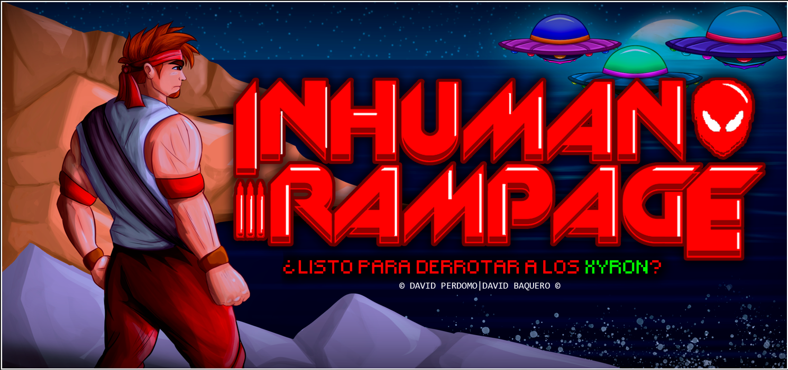
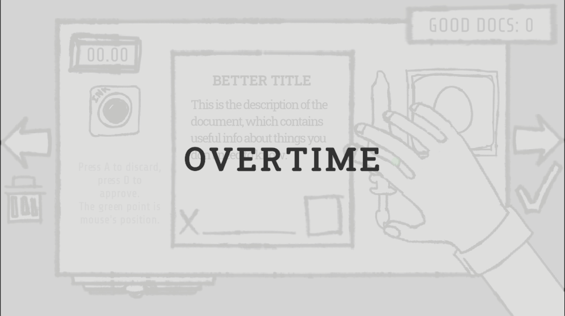

+++
draft = true
+++
# David Perdomo Medina: Desarrollador de Videojuegos
---------------------------
## Sobre mí
Soy un colombiano de 19 años con algo más de experiencia en programación que decidió afrontar el retador mundo del desarrollo de videojuegos.
# 
---------------------------
## Mis proyectos
### Proyectos compuestos

#### Inhuman Rampage

James Reynolds. Jefe de un pelotón asesinado por alienigenas de la raza Xyron, está sediento de venganza por sus amigos recien fallecidos. En colaboración con [@feba.arts](https://www.instagram.com/feba.arts/).

#### De-Molished

Un juego arcade de Realidad Aumentada para dispositivos Android que recrea la experiencia del juego Whack-A-Mole. (Requiere escanear una imagen en un dispositivo aparte)

#### Overtime

Videojuego realizado para la Trijam #322, donde controlas a un oficinista firmando documentos para evitar ser despedido.

#### Spin & Sauce

Videojuego colaborativo realizado para la Assemble Game Jam, donde debes alinear partes de una rueda de pizza según las necesidades del cliente.

### Prototipos
#### Thomas Was Alone (CLON)

Un clon del aclamado juego Thomas was alone, hecho para fines educativos.

#### Juego de celular sin título

En este juego controlas a un indio que tiene que proteger su cabaña de misiles enemigos usando un escudo bendito.

#### Inhuman Rampage (OLD)

Un alien conquistador llega a un planeta habitado unicamente por robots para realizar sus retorcidos planes. (Arte por [@feba.arts](https://www.instagram.com/feba.arts/))

### Misceláneos
#### Blender Render

Una animación hecha y renderizada en Blender imitando una famosa escena del cine.
# 
---------------------------
## Contactos
#### Teléfono: +57 314 502 9218
#### Correo electrónico: davidp3rd0m0.contacto@gmail.com
#### Redes sociales: 

# 
---------------------------
# Posts